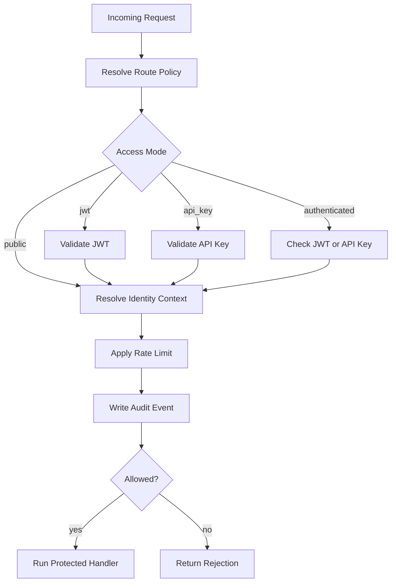
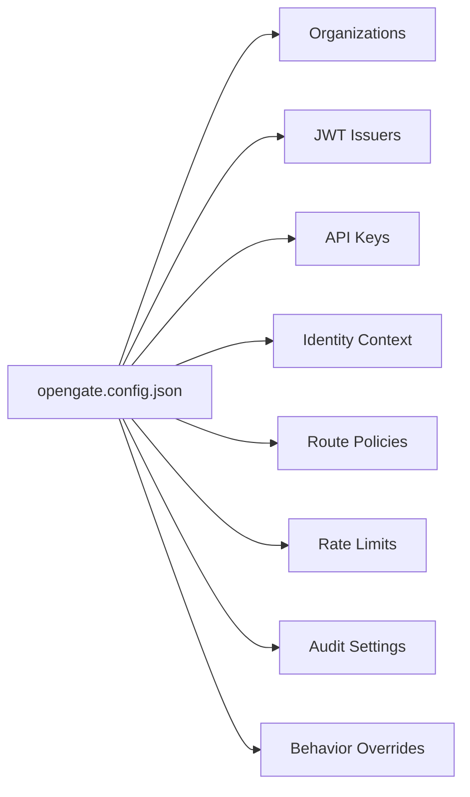

# OpenGate

OpenGate is a library-first security gate for existing HTTP API endpoints. You install it inside your backend, point it at the route you want to protect, and it handles caller identification, tiering, rate limiting, and audit logging before your handler runs.

## Tech Stack

<table>
  <tr>
    <td></td>
    <td></td>
    <td></td>
    <td></td>
  </tr>
  <tr>
    <td></td>
    <td></td>
    <td></td>
    <td></td>
  </tr>
</table>

## Screenshots

Anonymous request state:


Upgraded request state after login and `/api` access:


## How It Works

OpenGate sits between the request and the handler that eventually serves it. The host app still owns the route and the business logic, but OpenGate becomes the layer that decides whether the request should reach that logic at all.

Before installation, the endpoint is exposed directly:


After installation, OpenGate sits in front of the handler:


The request flow is deliberately small and predictable:



Configuration stays local and explicit. The config file is the source of truth, and each section controls one part of the gate:



The MVP is Fastify-first, which keeps the integration surface small and practical. The handler you already have is still the handler you keep; OpenGate simply becomes the layer in front of it, with the config file controlling how much of the gate is strict, permissive, or customized.

## Installation

The detailed installation guide lives in [docs/INSTALLATION.md](docs/INSTALLATION.md).

If you are integrating OpenGate into your own endpoint, that guide walks through the config shape, JWT and API-key setup, route registration, and audit storage.

## Example App

The repository includes a separate example app in [examples/website](examples/website). It shows the full flow in a compact form: a fake username/password login, JWT stored in an `HttpOnly` cookie, a single `GET /api` endpoint, and the same base response shape for free-tier and upgraded-tier access. Rate limiting and audit logging run behind the scenes.

Run it locally with:

```bash
npm install
npm run test
npm run dev
```

Then open [http://127.0.0.1:3000](http://127.0.0.1:3000).

## Notes

The MVP uses shared-secret JWT verification. That is the right tradeoff for the first implementation and for tightly controlled setups, but it is not the long-term production shape. For production, move JWT verification to an asymmetric model so OpenGate verifies with a public key instead of sharing the signing secret.

The current MVP is intentionally narrow: Fastify-first integration, in-memory rate limiting by default, SQLite audit logging, and no distributed rate-limit backend yet.

## Versioning

OpenGate follows semantic versioning. Release versions are generated from conventional commits through `semantic-release`, and the release workflow runs on pushes to `main`.

In practice:
- `fix:` becomes a patch release
- `feat:` becomes a minor release
- breaking changes become a major release

## License

MIT
