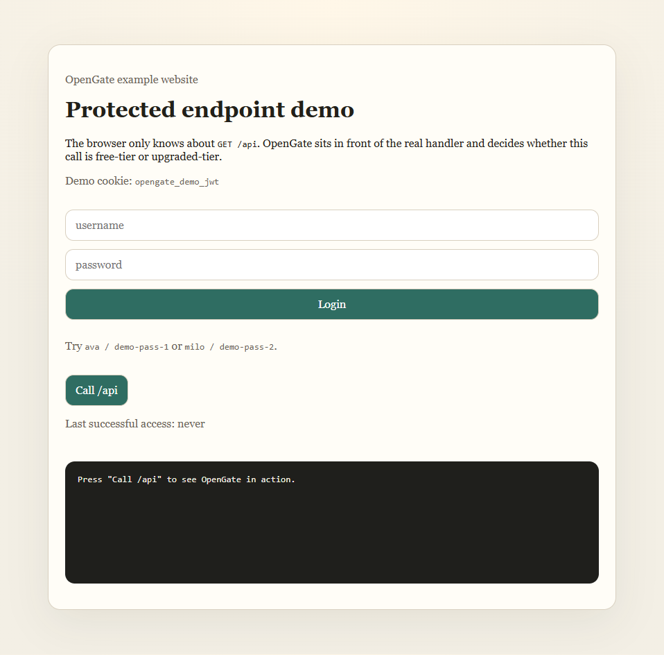
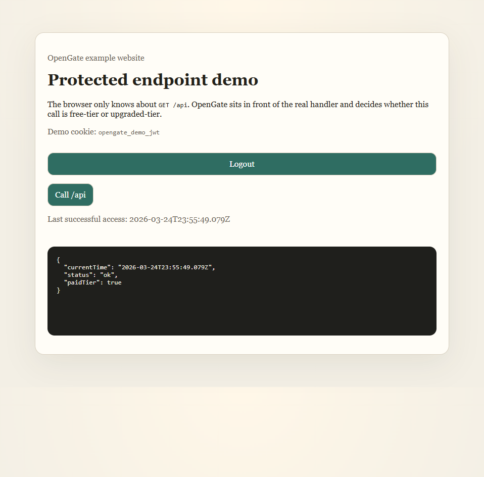
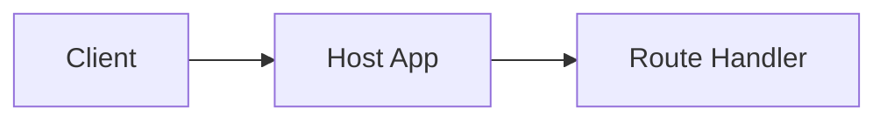
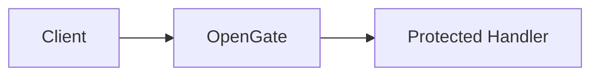
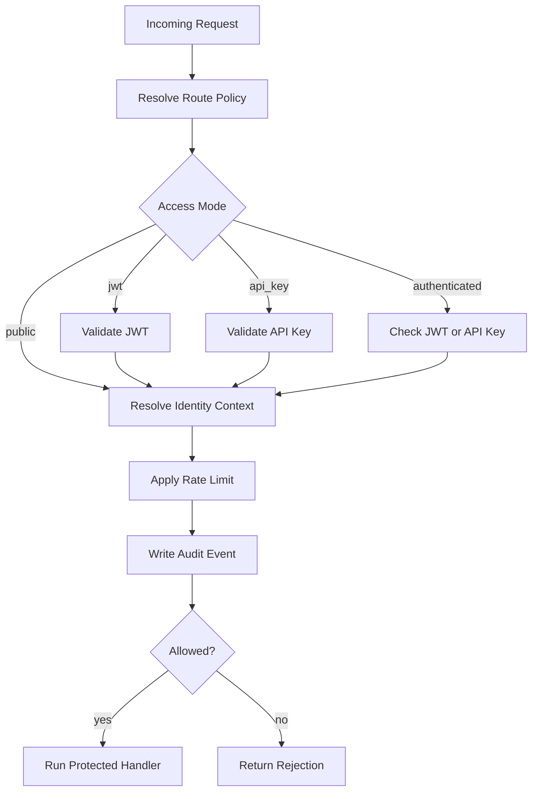
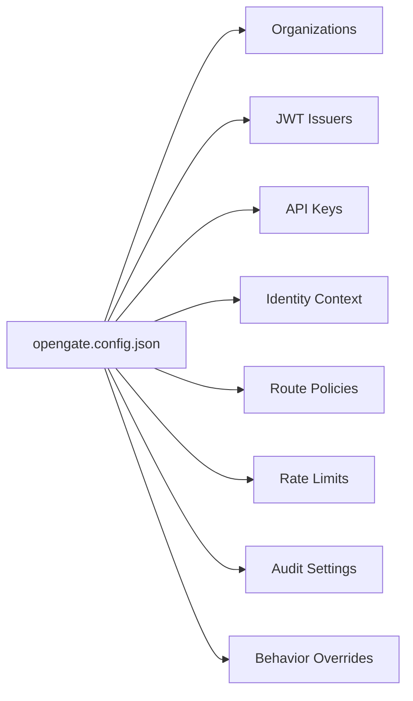

# OpenGate

OpenGate is a library-first security gate for existing HTTP API endpoints. You install it inside your backend, point it at the route you want to protect, and it handles caller identification, tiering, rate limiting, and audit logging before your handler runs.

The current library supports two JWT modes:
- demo mode with shared-secret JWT verification
- production mode with remote JWKS verification, issuer disablement, and key rotation support

The distribution model now includes:
- the root compatibility package, `opengate`
- explicit adapter packages, `@opengate/fastify` and `@opengate/express`
- template-driven starters for website, API, and partner/server-to-server installs
- a versioned docs site in [docs-site](docs-site)

## Tech Stack

<table>
  <tr>
    <td></td>
    <td></td>
    <td></td>
    <td></td>
  </tr>
  <tr>
    <td></td>
    <td></td>
    <td></td>
    <td></td>
    <td></td>
  </tr>
</table>

## Screenshots

Anonymous request state:



Upgraded request state after login and `/api` access:



## How It Works

OpenGate sits between the request and the handler that eventually serves it. The host app still owns the route and the business logic, but OpenGate becomes the layer that decides whether the request should reach that logic at all.

Before installation, the endpoint is exposed directly:



After installation, OpenGate sits in front of the handler:



The request flow is deliberately small and predictable:



Configuration stays local and explicit. The config file is the source of truth, and each section controls one part of the gate:



The MVP is Fastify-first, which keeps the integration surface small and practical. The handler you already have is still the handler you keep; OpenGate simply becomes the layer in front of it, with the config file controlling how much of the gate is strict, permissive, or customized.

## Installation

The detailed installation guide lives in [docs/INSTALLATION.md](docs/INSTALLATION.md).

If you are integrating OpenGate into your own endpoint, that guide walks through:
- demo/shared-secret setup
- production/JWKS setup
- versioned API-key rotation
- route registration
- audit redaction and storage
- the Fastify and Express adapter packages
- the `opengate init --template ...` starter flow

## CLI Quick Start

OpenGate now ships with a starter CLI:

```bash
npm run cli -- init --template website
npm run cli -- init --route mixed
npm run cli -- validate --file opengate.config.json
npm run cli -- migrate --file opengate.config.json
npm run cli -- control list organizations --file opengate.config.json
npm run cli -- control simulate --file opengate.config.json --method GET --path /api
```

If the package is installed in another project, the published command is `opengate`:

```bash
opengate init --route mixed
opengate validate --file opengate.config.json
opengate migrate --file opengate.config.json
opengate control list users --file opengate.config.json
opengate control export --file opengate.config.json --out export.json
```

The `init` command generates:
- `opengate.config.json`
- `server.ts`
- `README.md`
- `DEMO-CREDENTIALS.md`
- `data/audit-sample.json`

The template flag is now the preferred path:
- `website` for the browser login starter
- `api` for the JWT-protected API starter
- `partner` for the API-key starter

## Example App

The repository includes a separate example app in [examples/website](examples/website). It shows the full flow in a compact form: a fake username/password login, JWT stored in an `HttpOnly` cookie, a single `GET /api` endpoint, and the same base response shape for free-tier and upgraded-tier access. Rate limiting and audit logging run behind the scenes.

The same example now also exposes a lightweight protected `/admin` page for inspecting config, simulating requests, and managing demo keys and policies.

If you prefer the Express adapter, see [examples/express-website](examples/express-website). It mirrors the same story with the Express route registration helper and the same admin page.

If you want the same mock website before OpenGate is installed, see [examples/mock-website](examples/mock-website). That folder is the plain baseline plus a step-by-step install guide.

The generated docs site lives in [docs-site](docs-site) and is versioned alongside the packages. The built output goes to `docs-site/dist` when you run `npm run docs:build`.

## Control Plane

Phase 6 adds a lightweight control plane on top of the same runtime config and policy model.

Use the library API when you want to manage config in-process:

```ts
import { createControlPlane, registerControlPlaneRoutes } from "opengate";

const controlPlane = createControlPlane("./opengate.config.json");
registerControlPlaneRoutes(app, gate, controlPlane);
```

The control plane covers:
- listing and reading organizations, users, API keys, and route policies
- issuing, rotating, disabling, and revoking API keys
- exporting and importing JSON config
- simulating requests against the current policy model before rollout
- a lightweight protected `/admin` page in the example apps for the common workflows

The matching CLI commands use the same JSON model:
- `opengate control list organizations`
- `opengate control get users user-1`
- `opengate control issue api-key ...`
- `opengate control simulate --method GET --path /api`

Run it locally with:

```bash
npm install
npm run test
npm run dev
```

Then open [http://127.0.0.1:3000](http://127.0.0.1:3000).

## Notes

OpenGate still supports the MVP shared-secret JWT flow for demos and tightly controlled environments. For production, the recommended path is remote JWKS verification so OpenGate validates with rotating public keys instead of sharing the signing secret.

The product is still intentionally narrow in a few places: Fastify-first integration with an Express adapter, in-memory rate limiting by default, SQLite audit logging by default, and Redis/Postgres as the explicit scale-out path.

Phase 1 security upgrades now included:
- remote JWKS issuers with in-process caching
- one-refresh retry on unknown `kid`
- issuer disablement
- versioned API-key rotation and revocation windows
- validated audit-claim allowlists so only approved JWT claims are persisted

Phase 4 scale-out options are now available when you need them:
- set `rateLimits.store` to `redis` for multi-node rate limiting
- set `audit.backend` to `postgres` for a durable audit store
- tune `audit.flushIntervalMs`, `audit.batchSize`, and `audit.maxQueueSize` for higher-throughput deployments
- keep the in-memory and SQLite defaults for local dev and single-node demos

Phase 5 visibility is now available too:
- call `gate.registerOperationalRoutes(app)` to expose `/healthz`, `/readyz`, `/metrics`, and `/status`
- pass a logger adapter, such as `createConsoleLoggerAdapter()`, if you want structured JSON request logs
- use the `x-request-id` header, or override it with `observability.requestIdHeader`, to correlate logs and audit rows

## Versioning

OpenGate follows semantic versioning. Release versions are coordinated through Changesets, and the release workflow opens a version PR on pushes to `main`.

In practice:
- changesets define the package version bump
- the release workflow opens a version PR with coordinated package updates and changelogs
- the current root package stays backward compatible while the adapter packages and docs move in lockstep

## License

MIT
