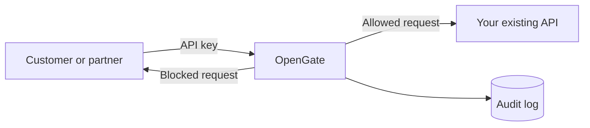
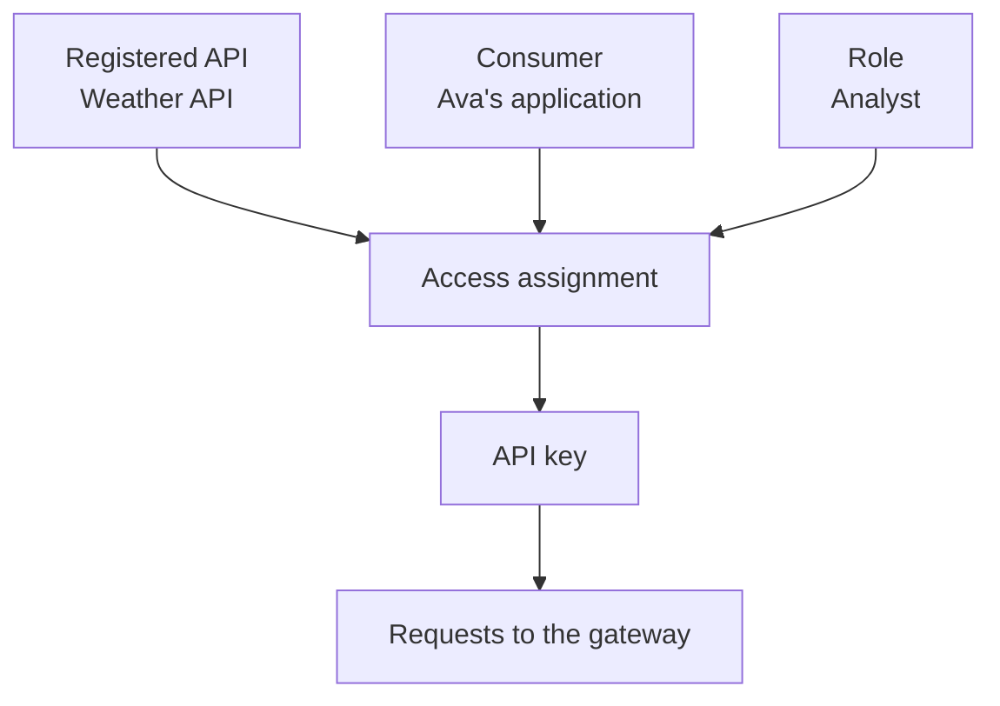
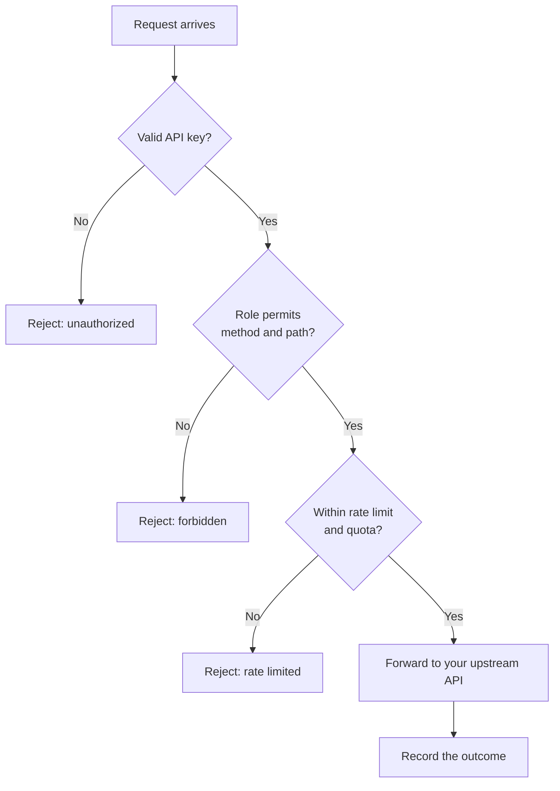

# OpenGate

OpenGate is a self-hosted gateway that sits in front of your existing HTTP APIs. It gives each customer, partner, or application an API key, checks what they are allowed to call, applies limits, and forwards approved traffic to your upstream service.

Use it when you want to offer an API without building API-key management, permissions, quotas, and request auditing into every service yourself.


```mermaid
flowchart LR
    C[Customer or partner] -->|API key| G[OpenGate]
    G -->|Allowed request| U[Your existing API]
    G -->|Blocked request| C
    G --> A[(Audit log)]
```

## What it handles

- API keys: issue, revoke, and rotate keys without storing the raw value
- Access control: permit specific HTTP methods and paths for each role
- Rate limits and quotas: control short bursts and longer-term usage
- Multiple APIs: manage several upstream APIs from one place
- Audit records: see what OpenGate allowed or blocked and why

## How access works

You register an API, create roles, then assign one role to each consumer for that API.


```mermaid
flowchart TD
    API[Registered API\nWeather API] --> ASSIGN[Access assignment]
    CONSUMER[Consumer\nAva's application] --> ASSIGN
    ROLE[Role\nAnalyst] --> ASSIGN
    ASSIGN --> KEY[API key]
    KEY --> REQUEST[Requests to the gateway]
```

For example, an `analyst` role could allow `GET /reports/*`, with a limit of 30 requests per minute and 5,000 requests per month.

## What happens on a request


```mermaid
flowchart TD
    R[Request arrives] --> K{Valid API key?}
    K -->|No| U[Reject: unauthorized]
    K -->|Yes| P{Role permits\nmethod and path?}
    P -->|No| F[Reject: forbidden]
    P -->|Yes| L{Within rate limit\nand quota?}
    L -->|No| T[Reject: rate limited]
    L -->|Yes| X[Forward to your upstream API]
    X --> LOG[Record the outcome]
```

Gateway URLs use this shape:

```text
https://gateway.example/apis/weather/reports/today
```

OpenGate checks access, then sends the matching request to the registered Weather API.

## Quick start

OpenGate v2 is a standalone, single-node service backed by SQLite.

```powershell
npm install
npm run build

$env:OPENGATE_DATABASE_URL = "./data/opengate.sqlite"
$env:OPENGATE_KEY_PEPPER = "replace-with-a-random-secret-at-least-32-characters"
$env:OPENGATE_SESSION_SECRET = "replace-with-a-different-random-secret-at-least-32-characters"
$env:OPENGATE_PUBLIC_BASE_URL = "http://127.0.0.1:8080"

node dist/src/v2/main.js migrate
node dist/src/v2/main.js bootstrap-admin --email admin@example.com
node dist/src/v2/main.js serve
```

Open [http://127.0.0.1:8080/admin](http://127.0.0.1:8080/admin) to configure APIs, consumers, roles, assignments, and keys. The bootstrap command prompts securely for an admin password.

For local development, set the same environment variables and run:

```powershell
npm run v2:dev
```

## Useful links

- [Operations guide](docs/v2/OPERATIONS.md) — backups, key rotation, health checks, and deployment notes
- [Implementation plan](spec/v2-implementation-plan.md) — technical architecture and project plan
- [License](LICENSE) — MIT
